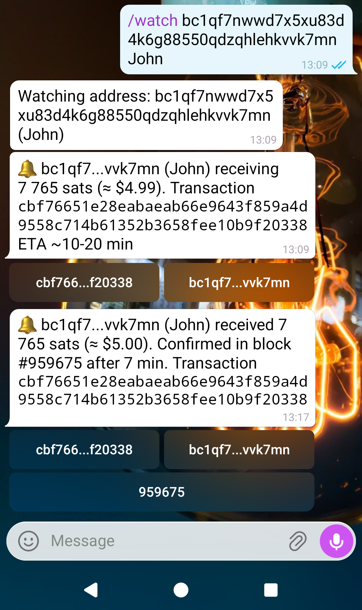
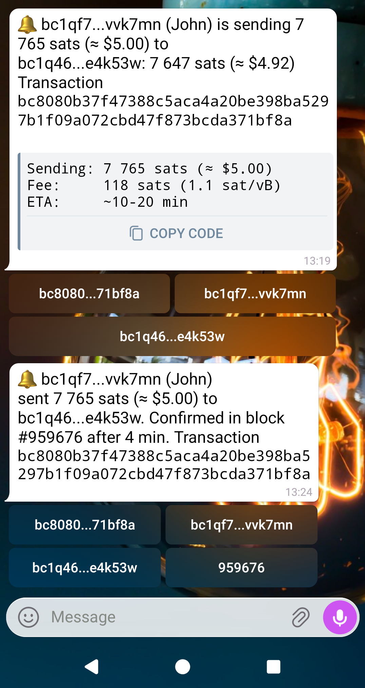
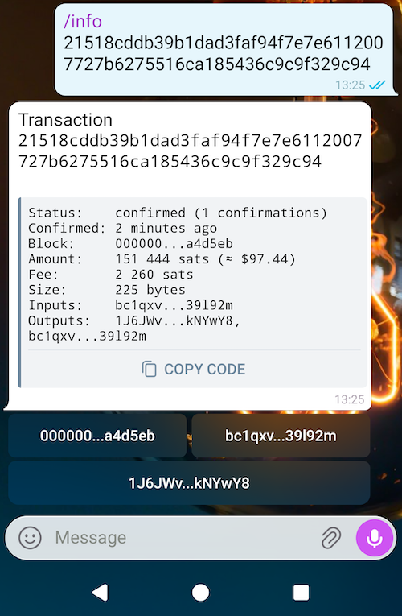

# bitnsbot

[@bitnsbot](https://telegram.me/bitnsbot)

Bitcoin network events notification bot. It can send notifications on watched addresses and transactions. It also sends various information and statistics on Bitcoin network





### How to run

#### Prerequisites

- Bitcoin Core node running with RPC, REST, ZMQ notification and transactions index enabled. Fully synced and **not** pruned
- [telegram-bot-api](https://github.com/tdlib/telegram-bot-api) running locally on the same machine

#### Command-line flags

| Flag | Default | Description |
|---|---|---|
| `-bot-token` | *(required)* | Telegram bot token used to authenticate outbound Bot API calls |
| `-listen` | `:8080` | Address the webhook server listens on |
| `-webhook-path` | `/bot` | Path the Bot API server will POST updates to |
| `-webhook-url` | | URL the Bot API server should send updates to, e.g. `http://localhost:8080/bot` |
| `-api-base-url` | `http://localhost:8081` | Base URL of the local `telegram-bot-api` server |
| `-secret-token` | | Optional secret checked against the `X-Telegram-Bot-Api-Secret-Token` header |
| `-register-webhook` | `true` | Call `setWebhook` on startup |
| `-db` | `watches.db` | Path to the bbolt watches database |
| `-core-url` | | Bitcoin Core JSON-RPC URL, e.g. `http://127.0.0.1:8332` (leave empty to skip connecting to the node) |
| `-core-user` | | Bitcoin Core RPC username (or use `-core-cookie`) |
| `-core-pass` | | Bitcoin Core RPC password (or use `-core-cookie`) |
| `-core-cookie` | | Path to Bitcoin Core's `.cookie` file, an alternative to `-core-user`/`-core-pass` |
| `-core-zmq` | | Comma-separated ZMQ endpoints publishing `hashblock` and `rawtx`, e.g. `tcp://127.0.0.1:28332,tcp://127.0.0.1:28333` |
| `-core-rest` | | Base URL of Bitcoin Core's REST interface for building the address index (empty disables indexing) |
| `-backup` | | Path to copy the database to periodically (empty disables backups) |
| `-backup-interval` | `24h` | How often to back up the database |
| `-backup-script` | | Command run after each backup, with the backup path as `$1` and in `$BACKUP_FILE` |
| `-verbose` | `0` | Log verbosity: `0` = ERR/WARN/status, `1` = +INFO, `2` = +NET/DB |
| `-log-no-ts` | `false` | Omit the date and time prefix from each log line |
| `-dbui-listen` | | Address for the database admin web UI, e.g. `127.0.0.1:8090` (empty disables it; bind to localhost only) |
| `-history-file` | | Path to a JSON file containing historical BTC/USD rates (same format as blockchain.info/charts/market-price); backfilled from this file on first run instead of fetching over the network |
| `-config` | | Path to a properties file (`name=value` lines) with flag values; command-line flags take precedence |

#### Configuration file

Instead of passing all flags on the command line, you can use a properties file. Lines are `name=value` pairs (without the leading `-`). Comments start with `#`.

Example `bitnsbot.conf`:

```properties
# Telegram
bot-token=123456:ABC-DEF1234ghijklmnop
webhook-url=http://127.0.0.1:8082/bot
listen=127.0.0.1:8082
api-base-url=http://localhost:8081

# Database
db=bitnsbot.db

# Bitcoin Core RPC (use either cookie or user/pass)
core-url=http://127.0.0.1:8332
# core-user=rpcuser
# core-pass=rpcpassword
core-cookie=/path/to/.cookie

# Bitcoin Core ZMQ for real-time block/tx notifications
core-zmq=tcp://127.0.0.1:28332,tcp://127.0.0.1:28333

# Bitcoin Core REST for address index
core-rest=http://127.0.0.1:8332

# Backups
backup=/var/backups/bitnsbot.db
backup-interval=24h

# Logging
verbose=1
```

#### Running

Build and run:

```bash
go test ./... && go build .
```

**With a configuration file:**

```bash
./bitnsbot -config=bitnsbot.conf
```

Any flags passed on the command line override values from the config file:

```bash
./bitnsbot -config=bitnsbot.conf -verbose=2
```

**With command-line flags only:**

```bash
./bitnsbot -bot-token=... -webhook-url=http://127.0.0.1:8082/bot -listen=127.0.0.1:8082 -db=bitnsbot.db -core-url=http://127.0.0.1:8332 -core-cookie=cookie -core-rest=http://127.0.0.1:8332 -core-zmq=tcp://127.0.0.1:28332 -verbose=1
```

Another option: there are [scripts](scripts) to deploy a bot as a systemd service.

### Useful tools

[advertise](tools/advertise) - simple command line tool which sends advertising packets with a specific IP to all nodes in Bitcoin network

dbui - simple web interface to manage bot database. Embedded into a bot itself 
                   
i18n-vet - check translation 

addrindex - build transaction history index on addresses. Gather other statistics

### Roadmap

- [x] I18N
- [x] Mini App
- [ ] Addresses statistics
- [ ] Daily statistics. Send every day market, transactions volume, moved coins, etc statistics
- [ ] Improve data quality. More reliable and correct answers on addresses
