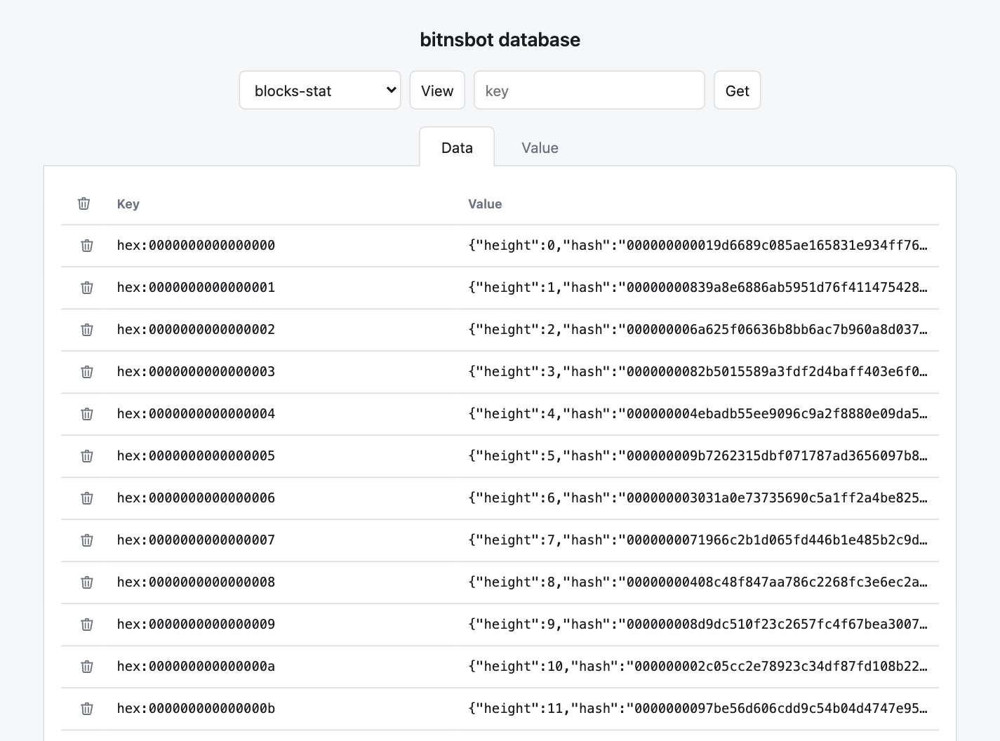
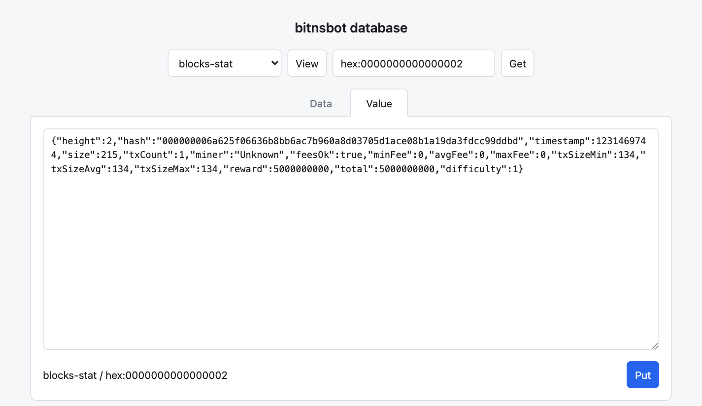

# bboltwui

Simple web UI for a [bbolt](https://github.com/etcd-io/bbolt) database. Point it
at a bbolt file and browse, edit, delete, export or import any bucket from a browser.

## Building

```
go build -o bboltwui ./tools/bboltwui/
```

## Running

```
./bboltwui -db bitnsbot.db -listen 127.0.0.1:8090
```

Then open <http://127.0.0.1:8090>. Both flags are required:

| flag      | what it is                                                |
|-----------|-----------------------------------------------------------|
| `-db`     | path to the bbolt file                                    |
| `-listen` | address to serve on, e.g. `127.0.0.1:8090`                 |

**Bind it to localhost.** There is no authentication and the UI can write and
delete any bucket, so it must never be exposed to a network.

bbolt locks the file exclusively, so it cannot open a database another process
already has open. It **waits for the lock rather than failing**

## What it looks like

Pick a bucket, press **View**, and the rows come back a page at a time. Keys and
values that are not text — are
shown behind a `hex:` marker, which is also how you type one back in.



Clicking a row opens its value in the **Value** tab, where **Put** writes it
back. **Get** does the same for a key typed in directly, and the trash icon on a
row deletes that key straight away — no confirmation, since clearing a bucket a
dialog at a time would be unusable.



The page is a single embedded HTML file that fetches nothing external, and the
whole UI is eight JSON endpoints: `/api/buckets`, `/api/view`, `/api/get`,
`/api/put`, `/api/delete`, `/api/clearbucket`, `/api/export` and `/api/import`.
